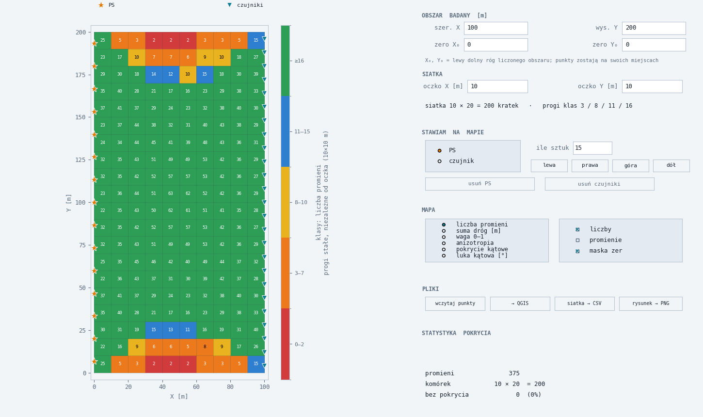

# Ray Coverage

An interactive tool for designing the geometry of a seismic survey. You place shot
points and sensors on a map and immediately see how well the resulting rays cover
the study area — before anyone drives into the field.

The model is deliberately simple: a homogeneous medium, so every source–receiver
pair is a straight segment. The program walks each segment across a rectangular
grid and records what passes through every cell, and from which directions.



## Running it

```
python app.py
```

Python 3.10+, `numpy` and `matplotlib` — nothing else. (`scipy` is optional and
only needed for `Coverage.to_sparse()`, which hands the tomography matrix G to an
external solver.)

## What it shows

Six maps over the same grid:

| map | meaning |
| --- | --- |
| ray count | how many rays crossed the cell |
| total path length | metres of ray inside the cell |
| weight 0–1 | ray count rescaled to the busiest cell |
| anisotropy | shape of the direction cloud: 0 = rays from all sides, 1 = all parallel |
| angular coverage | fraction of azimuths the cell receives rays from |
| largest angular gap | widest wedge of azimuths with no ray at all, in degrees |

The last three measure different things and are meant to be read together. A cell
can be crossed by fifty rays and still be badly resolved if they all run the same
way — and the anisotropy tensor cannot see holes in the direction distribution,
which is exactly what the angular gap is for.

Colour classes are absolute, counted in rays per cell (3 / 8 / 11 / 16), so maps
drawn with different cell sizes stay comparable.

## Controls

| | |
| --- | --- |
| left click | place a shot point / sensor |
| right click | remove the point under the cursor |
| `1` / `2` | switch between placing shot points and sensors |
| `c` | cycle the colour scale |
| `r` | show or hide the rays |
| `n` | show or hide the numbers in cells |
| `0` | fit the view back to the whole area |
| wheel | zoom around the cursor |
| middle drag | pan |

Coordinates can also be read from a file (`.xlsx`, `.csv`, `.txt`) instead of
being clicked in; the program asks which group is which.

## Exports

- **QGIS** — one ESRI ASCII grid per metric, plus the instrument positions as GeoJSON
- **CSV** — one row per cell, plus the geometry as `geometria.csv` (which the program reads back)
- **PNG** — the figure as drawn

## Layout

| file | |
| --- | --- |
| `app.py` | the interface — everything you click |
| `raycov.py` | the core: grid traversal, coverage metrics, tomography matrix G. No drawing, no files |
| `wczytaj.py` | reading point coordinates out of spreadsheets, with its own `.xlsx` reader |
| `test_raycov.py`, `test_wczytaj.py` | `pytest` |

The split is on purpose: the core carries no interface, so it can be tested and
used from a plain script just as well as from the window.

The user interface, comments and docstrings are in Polish.
